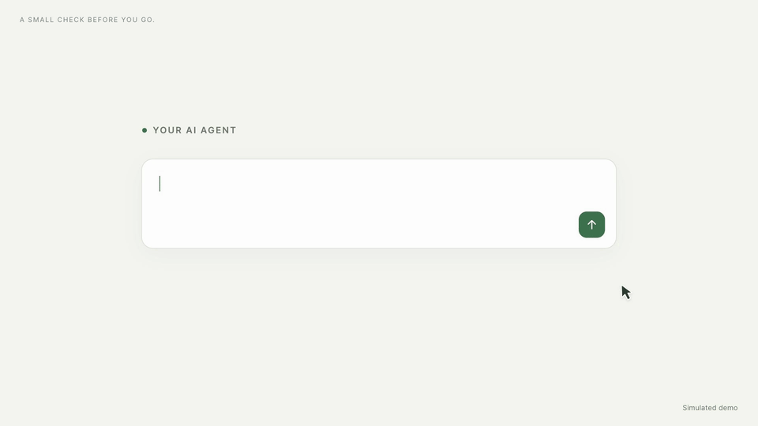

# airbattery-mcp

Let AI agents query the battery levels of your AirPods, iPhone, mouse, headphones and speakers.

A small MCP server on top of [AirBattery](https://github.com/lihaoyun6/AirBattery).
AirBattery discovers devices on your Mac; this server exposes their latest readings through a single read-only MCP tool over stdio.
Compatible clients, including Codex and Claude, can launch the same server. No client-specific API is used.
The server requires no Bluetooth permission of its own and runs as a process managed by the MCP client.

> Ask your AI agent: "I'm leaving in 20 minutes. What should I charge first?"



## Download

Download the `.mcpb` installation bundle from the **Assets** section of the
[latest release](https://github.com/Terence1219/AirBattery-mcp/releases/latest).
The initial release is [v0.1.0](https://github.com/Terence1219/AirBattery-mcp/releases/tag/v0.1.0).

- **Claude Desktop:** Download and install the `.mcpb` bundle, then ask Claude to check your device battery levels. You do not need to clone this repository for bundle installation.
- **Codex and other MCP clients:** Follow the [Setup](#setup) instructions to launch the server over stdio.

AirBattery must be installed and running on the same Mac. If you already configured this server manually, disable that configuration before using the bundle to avoid duplicate tools.

## Requirements

- macOS with [AirBattery](https://github.com/lihaoyun6/AirBattery) installed and running
- [uv](https://docs.astral.sh/uv/)
- An MCP client that supports local stdio servers, running on the same Mac

The server finds AirBattery's command line tool in this order:
`$AIRBATTERY_CLI`, `/usr/local/bin/airbattery` (AirBattery Settings → Command Line Tool),
`/Applications/AirBattery.app/Contents/Resources/abt`,
`~/Applications/AirBattery.app/Contents/Resources/abt`, then `airbattery` on `PATH`.

## Setup

Clone this repository, then replace `/absolute/path/to/AirBattery-mcp` below with the absolute path to the repository root.
Use the output of `command -v uv` wherever `/absolute/path/to/uv` appears.
The first launch may download Python and dependencies through uv.

### Codex

Register the local server:

```bash
codex mcp add airbattery -- /absolute/path/to/uv run --directory /absolute/path/to/AirBattery-mcp airbattery-mcp
```

Restart your Codex client to load the configuration. `codex mcp list` lists configured servers;
use `/mcp` in the Codex CLI to inspect active connections.
See the [official Codex MCP documentation](https://developers.openai.com/codex/mcp/) for client configuration details.

### Claude Desktop

Add the server to `~/Library/Application Support/Claude/claude_desktop_config.json`, merging it with any existing servers:

```json
{
  "mcpServers": {
    "airbattery": {
      "command": "/absolute/path/to/uv",
      "args": ["run", "--directory", "/absolute/path/to/AirBattery-mcp", "airbattery-mcp"]
    }
  }
}
```

Restart Claude Desktop afterwards. Alternatively, use the [release bundle](#download) or build one using the instructions below.

### Claude Code

```bash
claude mcp add airbattery -- /absolute/path/to/uv run --directory /absolute/path/to/AirBattery-mcp airbattery-mcp
```

### Other MCP clients

Add a **local stdio** MCP server in your client's settings.

First, find the full path to the `uv` executable:

```bash
command -v uv
```

Use that output as the **Command** value. Enter only the executable path in this field, for example `/Users/yourname/.local/bin/uv`.
Put the remaining command parts in **Arguments**, in this order:

```json
[
  "run",
  "--directory",
  "/absolute/path/to/AirBattery-mcp",
  "airbattery-mcp"
]
```

Replace `/absolute/path/to/AirBattery-mcp` with the absolute path to the repository root (the folder containing `pyproject.toml`).
If the client provides separate argument fields, enter each array element as one argument, without JSON quotes or commas.

For clients with a single full-command field, enter:

```bash
"/absolute/path/to/uv" run --directory "/absolute/path/to/AirBattery-mcp" airbattery-mcp
```

Replace both paths with your actual paths. The quotes preserve paths containing spaces.

Optionally set the environment variable `AIRBATTERY_CLI` to the absolute path of the AirBattery CLI executable if automatic discovery does not find it.

The client launches the server and calls `get_battery_status` through MCP. An MCPB installation package is not required for this setup.

### Install from Git

Once the MCP source is available in the remote repository, you can replace the local launch command with:

```bash
uvx --from "git+https://github.com/Terence1219/AirBattery-mcp" airbattery-mcp
```

For desktop clients, use the absolute path to `uvx` from `command -v uvx`.
Local setup is preferable while developing changes that have not been pushed.

## Tool

`get_battery_status(device?, include_nearcast?)`

```json
{
  "devices": [
    {
      "device": "AirPods Pro",
      "level_percent": 80,
      "status": "discharging",
      "minutes_since_update": 0,
      "stale": false
    }
  ]
}
```

- `device`: optional case-insensitive device-name substring filter
- `include_nearcast`: include devices reported by other Macs via AirBattery Nearcast; defaults to `false`
- `status`: `charging`, `discharging`, `paused`, or `unknown`
- `stale`: `true` when the reported reading is more than 10 minutes old

These are AirBattery's latest reported readings, not a guarantee of a fresh hardware measurement on every request.
A stale reading is a last known value and may belong to a disconnected device.
Device names and battery readings are returned to the connected MCP client and may be included in its model context.

## Development

Run from the repository root:

```bash
uv run airbattery-mcp
```

The process serves MCP over stdio and waits for a client to connect. Running it in a terminal does not print a battery report by itself.

The Python entry point is `src/mcp_server.py`; the installed `airbattery-mcp` command calls `mcp_server.main()`.

## Build an MCPB bundle

Install the [MCPB CLI](https://github.com/modelcontextprotocol/mcpb/blob/main/CLI.md), then run from the repository root:

```bash
mkdir -p dist
mcpb validate manifest.json
mcpb pack . dist/airbattery-mcp-0.1.0.mcpb
```

The bundle is an installation option for clients that support MCPB, such as Claude Desktop.
Codex can launch the source directly using the setup above.
Publish bundles as GitHub Release assets; keep their source files in Git.

## License

This project is licensed under the [MIT License](LICENSE).

AirBattery is a separate project under AGPL-3.0; this server only calls its command line tool.
